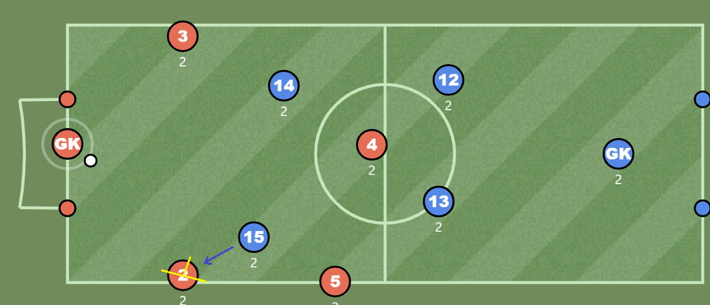

개인전술
=====
* 기본 체력(신체)을 전제
* 개인 생각 반영
- - -
## 목차
1. [시야 확보](#시야-확보)
2. [키핑](#키핑)
3. [패스 앤 무브](#패스-앤-무브)
4. [드리블](#드리블)

## 시야 확보
축구에서 시야 확보란 내 시야 안에 **공**과 **상대방**을 한 번에 두는 것[1]을 의미한다. 이는 공을 얼마나 잘 다루는가와는 무관하며 공을 받을 때 선수의 위치에 관한 문제이다. 빌드업 상황에서 수비의 위치를 예로 들어보자.

 

위와 같은 상황에서 키퍼가 빨간색 2번 선수에게 패스를 한다고 생각해보자. 2번 선수는 공을 받기 위해 공쪽으로 몸을 향하게 되고, 그 결과 파란색 15번이 시야 밖으로 벗어나게 된다. 따라서 등 뒤에서 압박을 받는 상황이 벌어진다. 하지만 만약 아래와 같이 위치를 잡았다고 생각해보자.

 

빨간색 2번이 라인으로 최대한 붙었기에 공과 파란색 15번을 같이 시야에 둘 수 있다[2]. 또한 이 경우 파란색 15번이 더 압박하게 된다면 중앙에 공간이 생기게 되어 기회가 생길 수 있다.

- - -
* [1]
	* 선수의 시야는 최대 180도를 전제하며, 이는 노란색 선으로 표현
* [2]  
	 
	* .

##### [목차로 이동](#목차)

## 키핑
탈압박.

##### [목차로 이동](#목차)

## 패스 앤 무브

##### [목차로 이동](#목차)

## 드리블

##### [목차로 이동](#목차)
